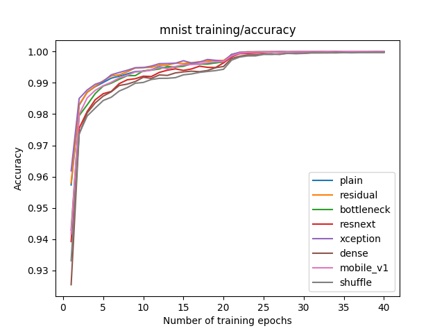
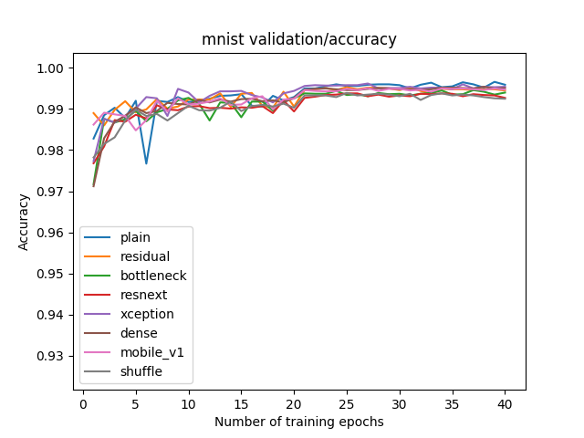
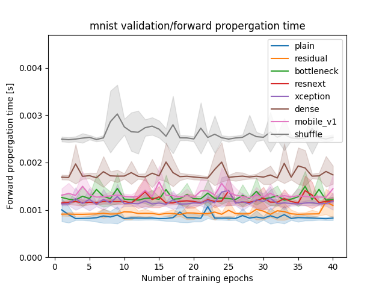
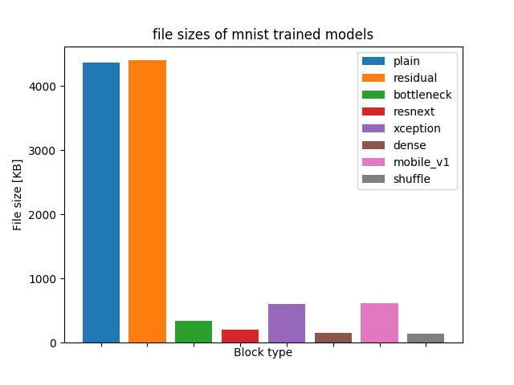
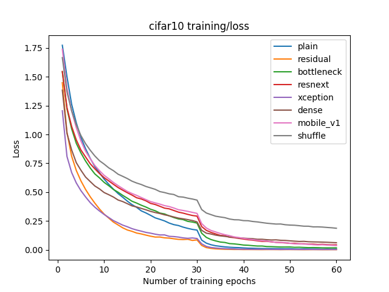
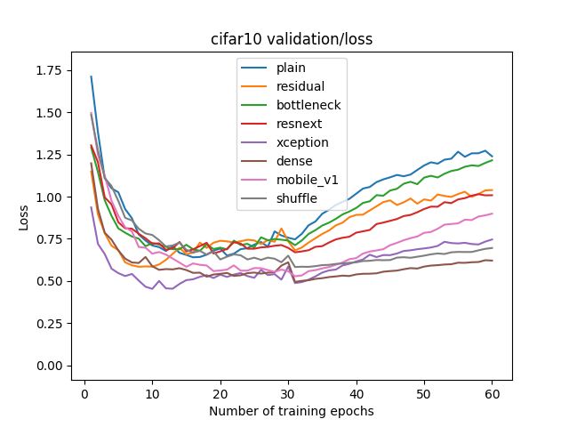
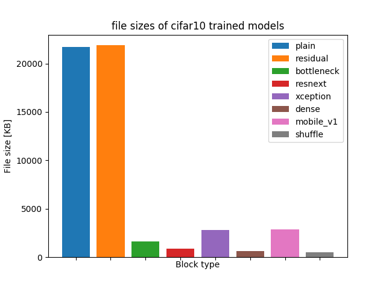
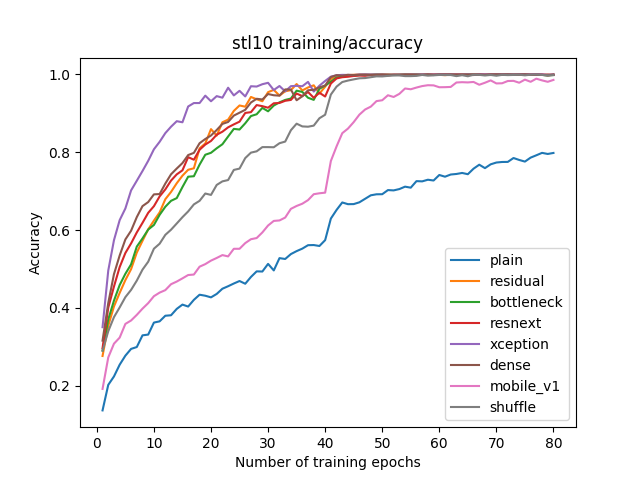
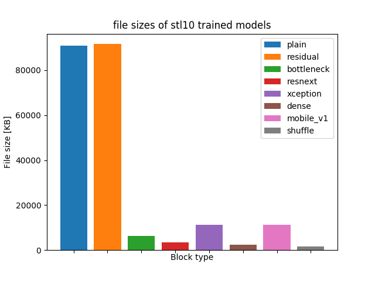

# pytorch-efficient-architecture
Efficient Convolutional Neural Networks with PyTorch

## Network architectures

Every stage has 4 blocks.

## Blocks
- plain type

  - BatchNorm - ReLU - Conv3x3 - BatchNorm - ReLU - Conv3x3

- residual type

- bottlenecked residual type

  - [He, Kaiming et al. “Deep Residual Learning for Image Recognition.” *2016 IEEE Conference on Computer Vision and Pattern Recognition (CVPR)* (2016): 770-778.](https://www.cv-foundation.org/openaccess/content_cvpr_2016/html/He_Deep_Residual_Learning_CVPR_2016_paper.html)

- resnext type

  - [Xie, Saining et al. “Aggregated Residual Transformations for Deep Neural Networks.” *2017 IEEE Conference on Computer Vision and Pattern Recognition (CVPR)* (2017): 5987-5995.](http://openaccess.thecvf.com/content_cvpr_2017/html/Xie_Aggregated_Residual_Transformations_CVPR_2017_paper.html)

- xception type

  - [Chollet, François. “Xception: Deep Learning with Depthwise Separable Convolutions.” *2017 IEEE Conference on Computer Vision and Pattern Recognition (CVPR)* (2017): 1800-1807.](http://openaccess.thecvf.com/content_cvpr_2017/html/Chollet_Xception_Deep_Learning_CVPR_2017_paper.html)

- dense type

  - [Huang, Gao et al. “Densely Connected Convolutional Networks.” *2017 IEEE Conference on Computer Vision and Pattern Recognition (CVPR)* (2017): 2261-2269.](http://openaccess.thecvf.com/content_cvpr_2017/html/Huang_Densely_Connected_Convolutional_CVPR_2017_paper.html)

- mobile type

  - [Howard, Andrew G. et al. “MobileNets: Efficient Convolutional Neural Networks for Mobile Vision Applications.” CoRR abs/1704.04861 (2017): n. pag.](https://arxiv.org/abs/1704.04861)

- shuffle type

  - [Zhang, Xiangyu et al. “ShuffleNet: An Extremely Efficient Convolutional Neural Network for Mobile Devices.” 2018 IEEE/CVF Conference on Computer Vision and Pattern Recognition (2018): 6848-6856.](https://arxiv.org/abs/1707.01083)

  

## Experiments

### MNIST
|training|validation|
|---|---|
|||
|||
|||

### CIFAR-10
|training|validation|
|---|---|
|||
|||
|||

### STL-10
|training|validation|
|---|---|
|||
|||
|||

### Food-101
UNDER CONSTRUCTION.
