# pytorch-efficient-architecture
Efficient Convolutional Neural Networks with PyTorch

## MNIST
|training|validation|
|---|---|
|||
|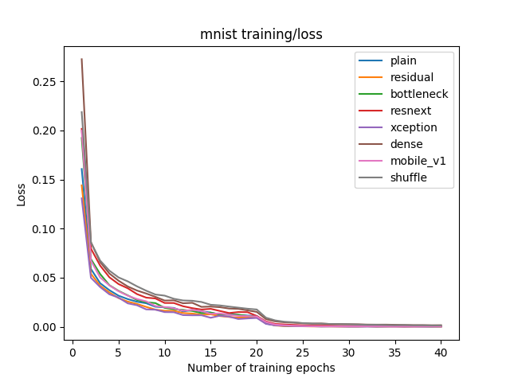|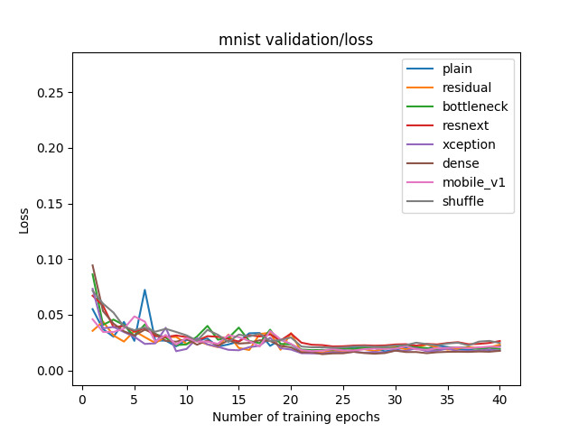|
|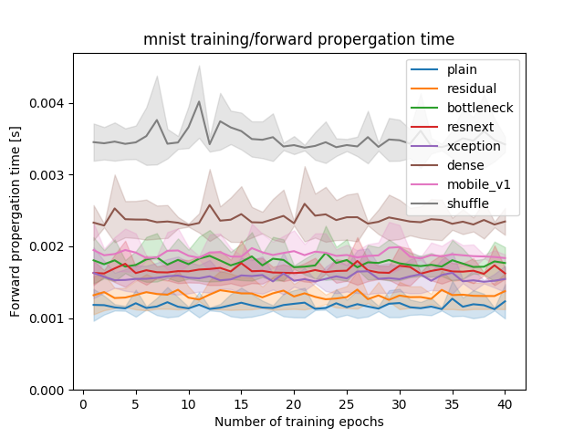||

## CIFAR-10
|training|validation|
|---|---|
|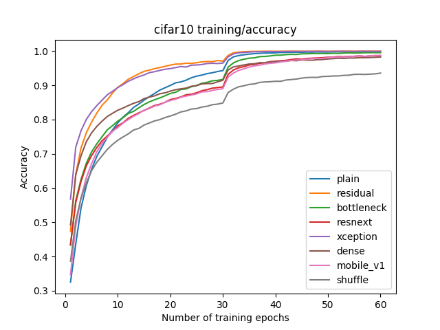|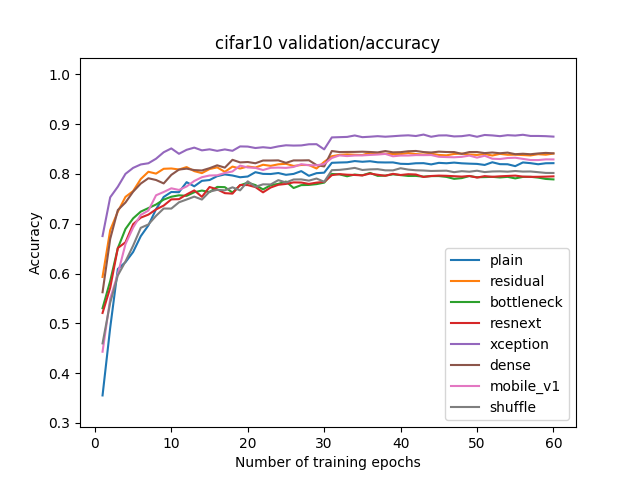|
|||
|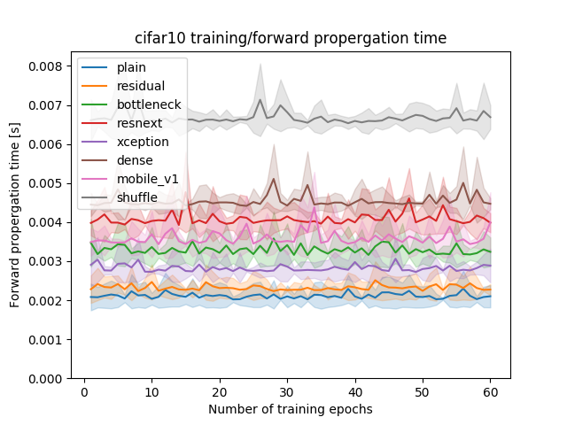|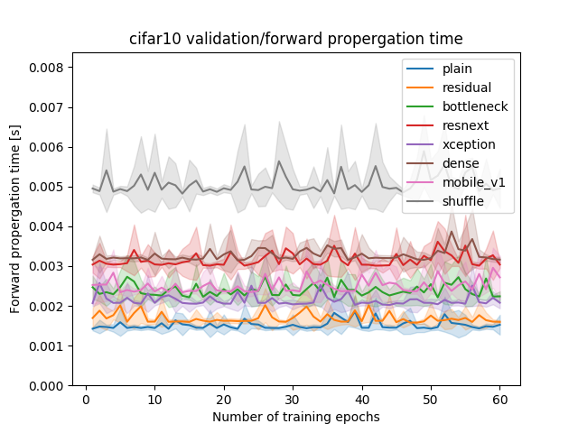|

## STL-10
|training|validation|
|---|---|
||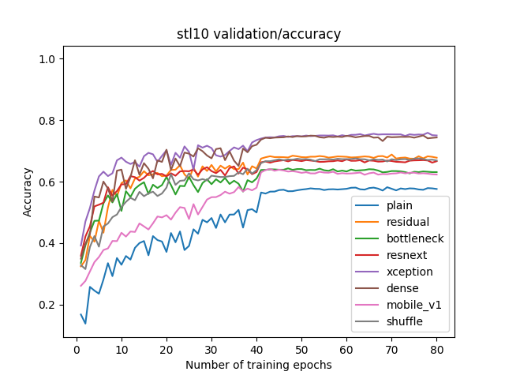|
|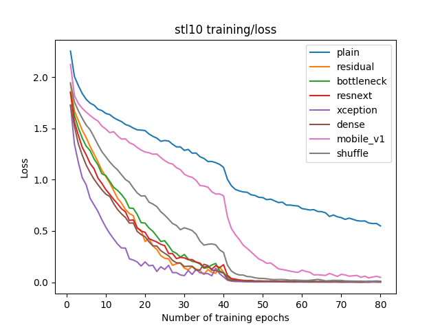|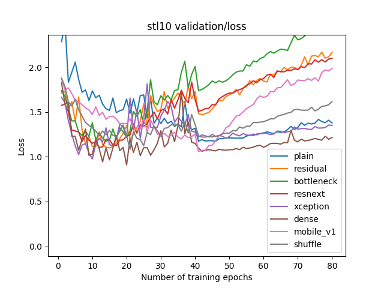|
||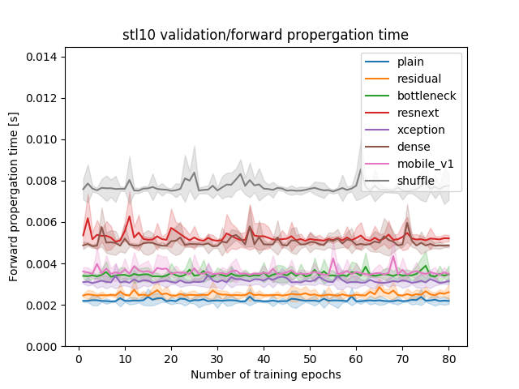|

